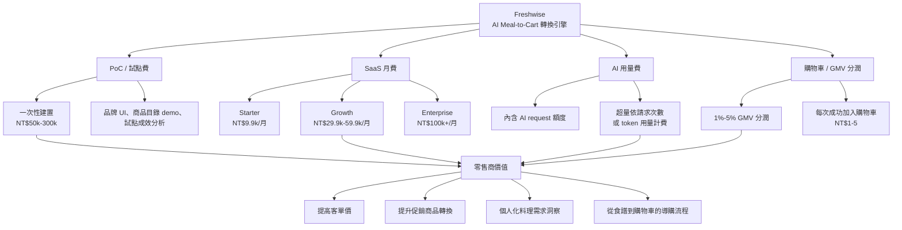

# Freshwise 商業模式

Freshwise 比較適合定位成 B2B / B2B2C 的「AI meal-to-cart 轉換引擎」，而不是單純賣給一般使用者的食譜 app。

## 收費策略圖

## 方案階梯

| 方案 | 目標客戶 | 價格方向 | 適合情境 |
| --- | --- | --- | --- |
| PoC / 試點 | 超市、生鮮電商、食品品牌 | 一次性 NT$50k-300k | 驗證轉換率與使用者體驗 |
| Starter | 小型零售商或展示型部署 | 約 NT$9.9k/月 | 輕量品牌 app 或 web widget |
| Growth | 區域型生鮮電商 / 通路 | NT$29.9k-59.9k/月 | 商品目錄串接、分析、促銷推薦 |
| Enterprise | 大型零售商 / 平台 | NT$100k+/月 | API 串接、SLA、客製流程、資安審查 |
| 用量 / 分潤 | 有實際流量的任一方案 | AI 超量費 + 1%-5% GMV 或每次加購計費 | 讓 Freshwise 收益與零售成果連動 |

## 核心收費邏輯

Freshwise 應該為「零售成果」收費：

- 把冰箱裡既有食材轉換成購買意圖。
- 透過「缺少食材」提高客單價。
- 提升促銷商品與品牌商品的轉換率。
- 建立個人化、可購物的料理流程。

最強的商業訊息是：

> Freshwise 不是在賣食譜，而是在賣由料理情境驅動的生鮮零售轉換。
