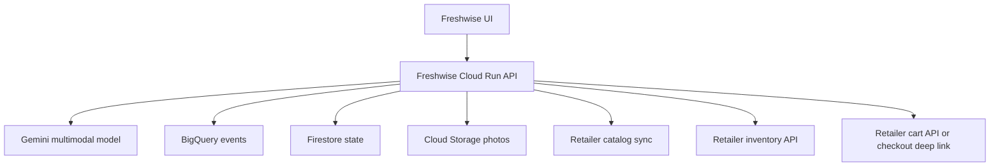

# Freshwise Future Integration Requirements

This document defines the next integration boundaries after the current Streamlit / Cloud Run PoC.

## Retailer Inventory API Requirements

Freshwise needs inventory data to avoid recommending unavailable products.

Minimum fields:

| Field | Description |
| --- | --- |
| `catalog_product_id` | Retailer SKU or stable catalog ID |
| `store_id` | Store, region, or fulfillment node |
| `available_quantity` | Current sellable quantity or availability bucket |
| `availability_status` | `in_stock`, `low_stock`, `out_of_stock`, `unknown` |
| `updated_at` | Inventory freshness timestamp |

Recommended behavior:

- Refresh inventory before showing final cart recommendations.
- Hide or downgrade `out_of_stock` products.
- Mark `low_stock` products in recommendation ranking.
- Fall back to category alternatives when exact products are unavailable.

## Cart API Or Checkout Deep-Link Requirements

Freshwise needs one of two checkout paths.

### Option A: Cart API

Minimum operations:

- create cart
- add item
- update quantity
- remove item
- retrieve cart
- generate checkout URL

Minimum item payload:

| Field | Description |
| --- | --- |
| `catalog_product_id` | Retailer SKU |
| `quantity` | User-selected quantity |
| `store_id` | Fulfillment context when required |
| `promotion_id` | Campaign attribution |
| `source` | `freshwise` |

### Option B: Checkout Deep Link

Use when the retailer does not expose a writeable cart API.

Requirements:

- Accept product IDs and quantities in a signed URL or server-side cart token.
- Preserve attribution fields through checkout.
- Return success/cancel signals when possible.

## Product Catalog Import Format

Freshwise should support CSV or JSON catalog import for PoC, then API sync for production.

Required fields:

| Field | Description |
| --- | --- |
| `catalog_product_id` | Stable SKU ID |
| `name` | Display name |
| `category` | Product category |
| `price` | Current selling price |
| `currency` | Price currency |
| `promotion_label` | Campaign or merchandising label |
| `image_url` | Product image for richer UI |
| `active` | Whether product can be recommended |

Recommended fields:

- `brand`
- `package_size`
- `dietary_tags`
- `substitutes`
- `margin_band`
- `priority_score`
- `tenant_config_version`

## Promotion Campaign Mapping

Promotion mapping determines how Freshwise balances recipe fit with retailer goals.

Minimum campaign fields:

| Field | Description |
| --- | --- |
| `promotion_id` | Campaign ID |
| `promotion_label` | Human-readable campaign label |
| `catalog_product_id` | SKU included in campaign |
| `start_at` | Campaign start |
| `end_at` | Campaign end |
| `priority` | Ranking influence |

Recommended ranking inputs:

- recipe relevance
- inventory availability
- price
- promotion priority
- category diversity
- retailer margin band

## Persistent App State Decision

Use Firestore for the next pilot.

Rationale:

- Session, ingredient, recipe, and mock cart state are document-shaped.
- Firestore is simpler than Cloud SQL for the current app workflow.
- It supports fast iteration without relational schema management.
- Cloud SQL can be revisited when orders, accounts, payments, or complex reporting become first-class production data.

Suggested collections:

- `sessions`
- `ingredient_sets`
- `recipe_runs`
- `carts`
- `orders`
- `tenant_configs`

## Cloud Storage Photo Abstraction

Fridge photos should move out of Streamlit session memory for pilot and production.

Requirements:

- Store uploaded photos in Cloud Storage.
- Use signed URLs or service-account-only access.
- Attach `photo_uri` to recognition events.
- Apply lifecycle retention rules.
- Avoid storing photos longer than needed for PoC analysis unless user consent and retailer policy allow it.

Suggested path format:

```text
gs://freshwise-photos/{tenant_id}/{session_id}/{photo_id}.jpg
```

Suggested metadata:

- `tenant_id`
- `session_id`
- `uploaded_at`
- `recognition_model`
- `retention_policy`

## Recommended Next Architecture


