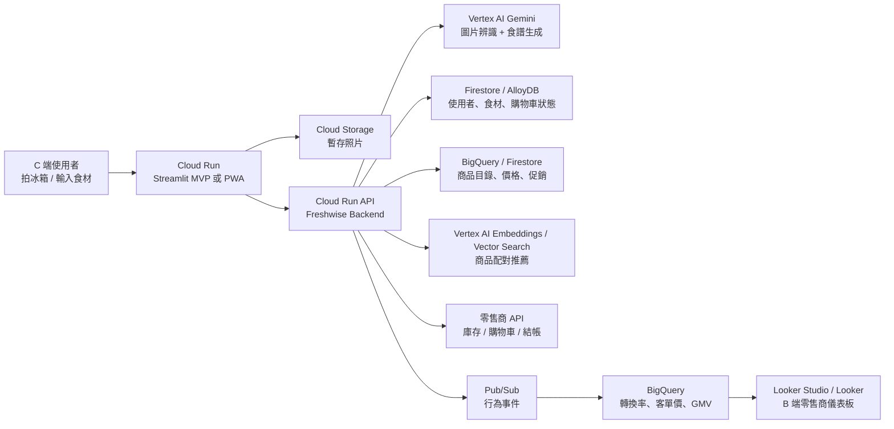

# Freshwise GCP Implementation Plan

## 目標

根據 Freshwise 的產品規劃，將「使用者食材與料理需求」轉換成「可購買的購物車」，並同時為生鮮零售商提供 B2B / B2B2C 的轉換率、客單價、商品曝光與 GMV 數據。

Freshwise 在 GCP 上可以分成兩層：

- C 端體驗層：食材輸入、冰箱照片辨識、AI 食譜、缺少食材判斷、商品推薦與加入購物車。
- B 端變現層：零售商儀表板、推薦成效、商品曝光、轉換率、客單價與 GMV 分析。

## 建議 GCP 架構

## 圖中流程對應實作

### 1. 食材輸入 / 冰箱辨識

使用者可透過手機拍攝冰箱照片，或手動輸入目前擁有的食材。

GCP 實作：

- 前端：Cloud Run 部署目前的 Streamlit app，未來可替換成 React / Next.js PWA。
- 圖片暫存：Cloud Storage。
- 圖片辨識：Vertex AI Gemini multimodal model。
- 使用者狀態：Firestore。

資料流程：

1. 使用者上傳或拍攝照片。
2. 前端將照片送到 Cloud Run API。
3. API 將照片暫存到 Cloud Storage。
4. API 呼叫 Vertex AI Gemini 辨識食材。
5. 辨識結果寫回 Firestore，並回傳給前端讓使用者確認。

### 2. AI 食譜生成

系統根據使用者擁有的食材、料理偏好與零售商的商業目標，產生多個食譜選項。

GCP 實作：

- 食譜生成：Vertex AI Gemini。
- Prompt orchestration：Cloud Run API。
- 食譜結果暫存：Firestore。
- 商業規則：Cloud Run 內的推薦邏輯，或後續拆成獨立 Recommendation Service。

Prompt 應包含：

- 使用者目前已有食材。
- 零售商商品目錄。
- 促銷商品或高毛利商品。
- 使用者語言。
- 輸出格式，例如 JSON schema。

### 3. 缺少食材判斷

系統比較「食譜需要的食材」與「使用者已有食材」，判斷缺少哪些品項。

GCP 實作：

- MVP：Cloud Run 內用 Python 規則比對。
- 進階：建立標準化食材字典，例如 tomato、cherry tomato、番茄、小番茄的關聯。
- 狀態資料：Firestore。
- 分析資料：BigQuery。

缺少食材判斷不只是功能，也會影響商業價值。缺少的食材會成為推薦商品、促銷商品與購物車轉換的入口。

### 4. 商品配對 / 推薦

將缺少食材配對到零售商可銷售的商品。

GCP 實作：

- 商品目錄：BigQuery 或 Firestore。
- 商品語意搜尋：Vertex AI Embeddings + Vertex AI Vector Search。
- 推薦排序：Cloud Run Recommendation Service。
- 促銷與商業規則：BigQuery 商品欄位或 Firestore 設定。

推薦排序可考慮：

- 食譜相關性。
- 有無庫存。
- 價格。
- 毛利。
- 促銷檔期。
- 品牌曝光需求。
- 使用者偏好。
- 過往轉換率。

### 5. 一鍵加入購物車

使用者選擇食譜後，可以把缺少食材對應的商品加入購物車。

GCP 實作：

- Demo 階段：購物車狀態存在 Firestore。
- 正式階段：Cloud Run Retailer Connector 串接零售商 API。
- 非同步任務：Cloud Tasks。
- 事件追蹤：Pub/Sub。

零售商 API 可能包含：

- 商品查詢。
- 即時價格。
- 即時庫存。
- 加入購物車。
- 結帳連結。
- 會員登入或 token exchange。

若未來要支援多家大型零售商，可以考慮用 Apigee 管理 API gateway、rate limit、partner access 與企業級 API 治理。

## B 端零售商儀表板

Freshwise 的 B 端價值來自可量化的轉換與營收指標。

GCP 實作：

- 事件收集：Pub/Sub。
- 事件處理：Cloud Run jobs 或 Dataflow。
- 數據倉儲：BigQuery。
- 儀表板：Looker Studio 或 Looker。

建議追蹤事件：

- ingredient_detected
- recipe_generated
- recipe_selected
- product_recommended
- product_clicked
- add_to_cart
- checkout_started
- order_completed

建議儀表板指標：

- 食譜生成次數。
- 推薦商品曝光。
- 商品點擊率。
- 加入購物車率。
- 結帳轉換率。
- 平均客單價。
- GMV。
- 熱門食譜。
- 熱門缺少食材。
- 熱門推薦商品。

## MVP 到正式產品的落地階段

### Phase 1: GCP Demo

目的：快速把目前 Streamlit MVP 放到 GCP，可用手機展示完整流程。

範圍：

- Cloud Run 部署 Streamlit app。
- Secret Manager 管理 Gemini / Vertex AI 設定。
- Cloud Storage 暫存照片。
- Firestore 保存 session、食材與購物車。
- BigQuery 保存基本事件。

### Phase 2: B2B PoC

目的：讓零售商看到可衡量的商業價值。

範圍：

- 接入零售商商品目錄。
- 加入促銷與推薦排序規則。
- 商品推薦事件進 BigQuery。
- Looker Studio 建立零售商儀表板。
- Demo cart 或 deep link 到零售商購物車。

### Phase 3: Production SaaS

目的：支援多零售商、多品牌、多租戶與正式商業化。

範圍：

- 前端改成 PWA 或嵌入式 widget。
- 後端拆成 API service、recommendation service、retailer connector。
- 使用 Identity Platform 或 Firebase Authentication。
- 多租戶資料模型。
- Vertex AI Vector Search 做商品語意配對。
- BigQuery 建立完整成效分析。
- Cloud Monitoring / Error Reporting / Logging 建立營運監控。

## 目前專案需要調整的地方

目前 repo 是 Streamlit MVP，適合 Phase 1。正式放到 GCP 前，建議做以下調整：

1. 新增 Dockerfile，讓 Cloud Run 可以穩定啟動 Streamlit。
2. 將 `st.secrets` 改成同時支援環境變數，例如 `GOOGLE_API_KEY`、`DEFAULT_MODEL`。
3. 若改用 Vertex AI，改成用 service account 驗證，不再依賴 API key。
4. 加入 Cloud Storage photo upload abstraction，避免圖片只存在 Streamlit session。
5. 加入 event logging function，將關鍵行為寫入 BigQuery 或 Pub/Sub。
6. 將 mock catalog 抽成獨立資料來源，之後可替換成零售商商品 feed。

## 建議服務選型

| 需求 | GCP 服務 |
| --- | --- |
| Streamlit / Backend API | Cloud Run |
| 圖片暫存 | Cloud Storage |
| 圖片辨識與食譜生成 | Vertex AI Gemini |
| API key / credentials | Secret Manager |
| 使用者狀態 / session / cart | Firestore |
| 商品目錄與分析 | BigQuery |
| 商品語意搜尋 | Vertex AI Embeddings + Vector Search |
| 非同步事件 | Pub/Sub |
| 背景任務 | Cloud Tasks / Cloud Run jobs |
| 零售商儀表板 | Looker Studio / Looker |
| 登入與租戶管理 | Identity Platform / Firebase Authentication |
| 監控 | Cloud Logging / Cloud Monitoring / Error Reporting |

## 參考資料

- Cloud Run Streamlit quickstart: https://docs.cloud.google.com/run/docs/quickstarts/build-and-deploy/deploy-python-streamlit-service
- Vertex AI Gemini image understanding: https://docs.cloud.google.com/vertex-ai/generative-ai/docs/multimodal/image-understanding
- Looker Studio: https://docs.cloud.google.com/looker/docs/studio
